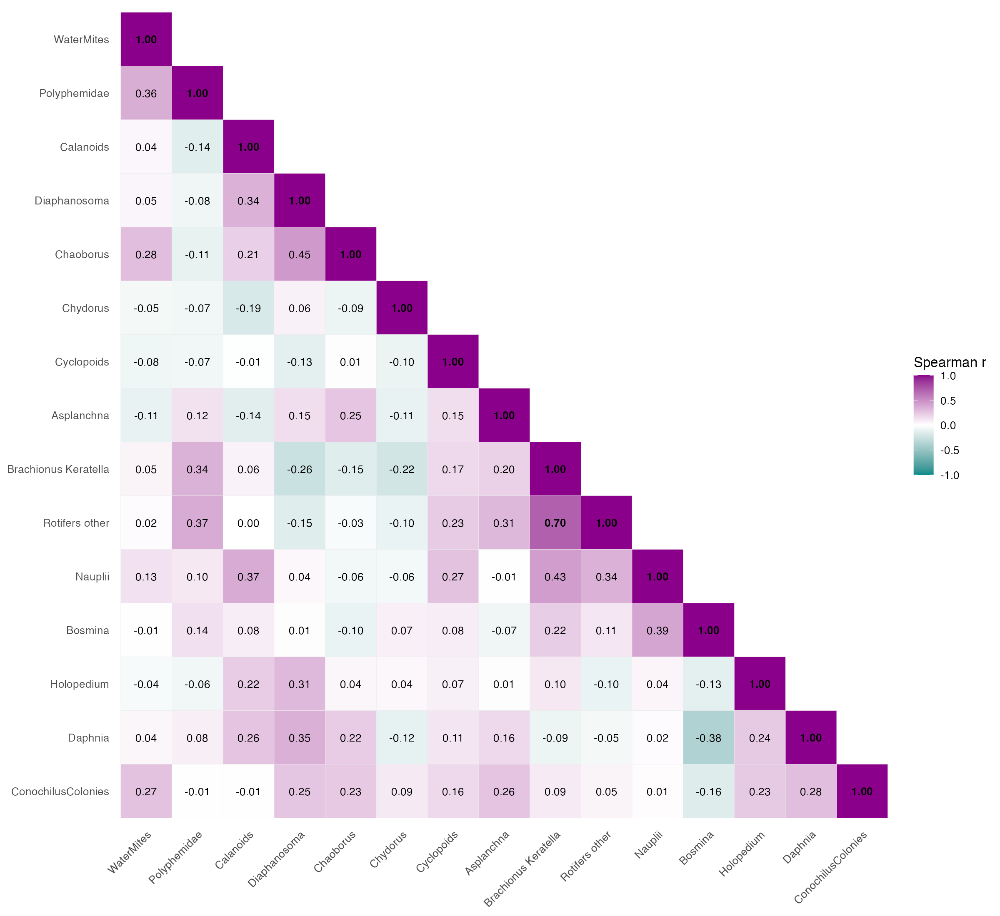
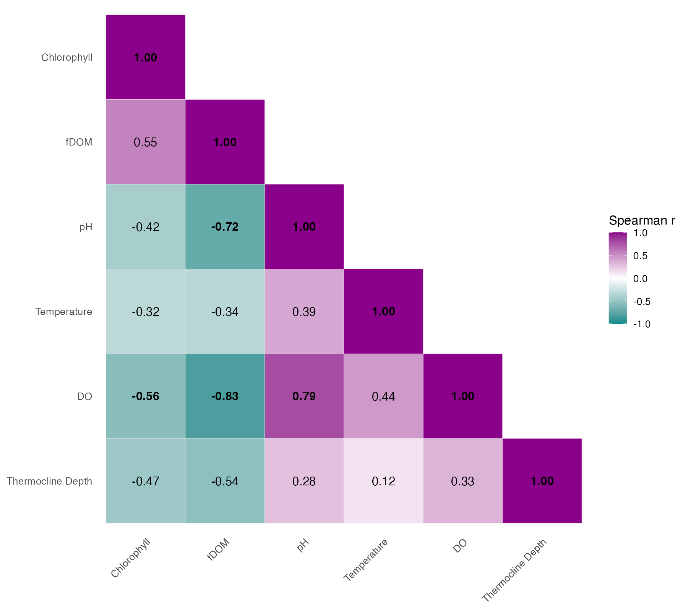

# Correlation Results

This report shows the current correlation figures generated from the shared analysis dataset.

## Biotic Correlations

Lake-level Spearman correlations across zooplankton taxa.

- Table: `biotic/biotic_correlation_table.csv`

## Abiotic Correlations

Lake-level Spearman correlations across integrated environmental predictors and thermocline depth.

- Table: `abiotic/abiotic_correlation_table.csv`
