# SEM model: model_run

Output directory: `sem_runner/results_piecewise/model16_eutrophication_composite_linear_all_lakes`

## Lake coverage

Model uses 39 lake-level medians (deep/single habitat).

Deep/single candidates prior to dropping missing covariates: 39.

Unique lakes in the main dataset before exclusions: 41.

### Piecewise per-equation sample sizes

| equation | response | n_lakes |
|---|---|---|
| bf_cal | cal_log1p | 39 |
| bf_cyc | cyc_log1p | 28 |
| bf_eut | eutroph | 28 |

### Missing data by submodel (piecewise)

Each submodel is fit on the subset of lakes with complete data for the response and its predictors. The table below summarizes sample sizes and the most common missing variables; per-submodel dropped-lake lists are written as `missingness_<response>.csv` in the output directory.

| equation | response | n_total | n_used | n_dropped | top_missing |
|---|---|---|---|---|---|
| bf_cyc | cyc_log1p | 39 | 28 | 11 | deforestation (% forest loss) (11); cyclopoids (0); eutrophication composite (0); calanoids (0) |
| bf_eut | eutroph | 39 | 28 | 11 | deforestation (% forest loss) (11); eutrophication composite (0) |
| bf_cal | cal_log1p | 39 | 39 |  0 | calanoids (0); eutrophication composite (0) |

## Model validation (MCMC + posterior predictive checks)

For each piecewise submodel we record basic MCMC convergence diagnostics (R-hat and effective sample sizes) and run posterior predictive checks (density overlays) plus posterior predictive PIT checks (histogram + ECDF vs Uniform(0,1)). PIT here is computed from posterior predictive draws on the fitted data (not leave-one-out).

| response | n_obs | max_rhat | min_ess_bulk | min_ess_tail | n_divergent | n_treedepth_saturated |
|---|---|---|---|---|---|---|
| cal_log1p | 39 | 1.001103 | 4734.466 | 5344.807 | 0 | 0 |
| cyc_log1p | 28 | 1.000599 | 4819.544 | 6755.186 | 0 | 0 |
| eutroph | 28 | 1.000667 | 4621.502 | 5327.602 | 0 | 0 |

Artifacts (per response) are written to the output directory with prefixes `ppc_` (density PPC) and `ppc_pit_` (PIT histogram/ECDF), and a full parameter-level diagnostics table `mcmc_diagnostics_params_<response>.csv`.

## Composite figure

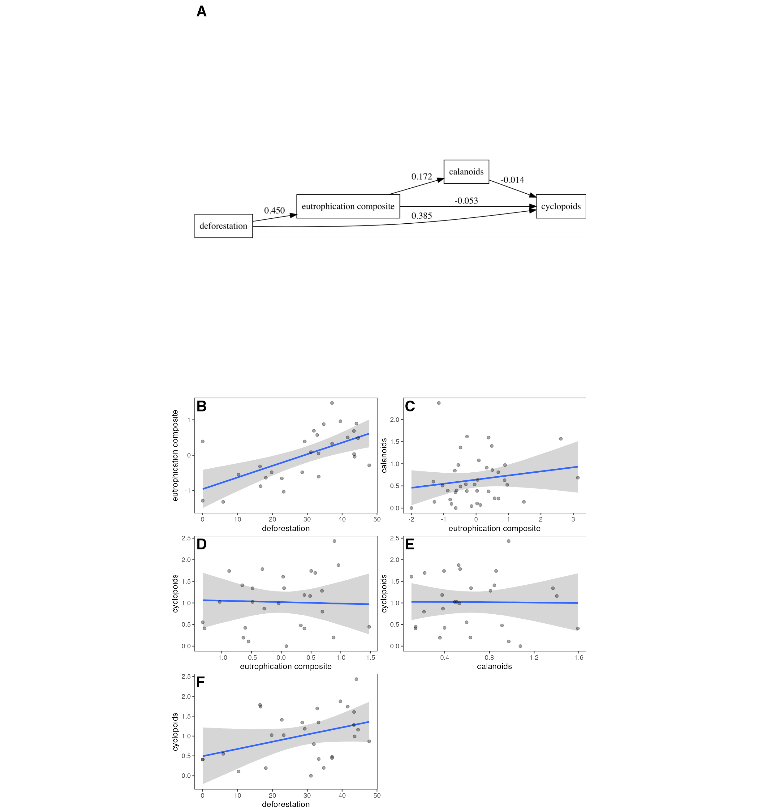

Figure. Piecewise structural equation model (SEM) of deep/single lakes. The path diagram in panel A shows directed links among responses; edge labels are posterior median regression coefficients from BRMS Gaussian components (density variables on the natural-log scale, ln(1 + x)). Residual correlations were set to zero (rescor = FALSE).

Panel A (Path diagram). Directed graph with edges labeled by posterior median standardized coefficients (global SD scaling). Raw and standardized edge summaries are saved in `path_diagram_edges.csv` (columns `*_raw` and `*_std`). Node names: thermocline depth = “thermo”, chlorophyll = “chl_log1p”, calanoids = “cal_log1p”, cyclopoids = “cyc_log1p”, pH = “pH”, oxygen = “oxy”.

Panels B–C (conditional effects). Fitted mean responses with 95% credible bands for exemplar paths; x‑axes cover the central 96% of observed predictor values (2nd–98th percentiles).

Data and preprocessing. All abiotic predictors are water‑column integrated summaries (integrated_chl, integrated_fDOM, integrated_pH, integrated_temp, integrated_DO_percent; thermocline_depth_m from profiles). Density responses are modeled on the natural-log scale using ln(1 + x) transforms. 

## Coefficients

### coefficients_callog1p_model16_eutrophication_composite_linear_all_lakes.csv

| Parameter | Term | Mean | SD | Q2.5 | Q97.5 |
|---|---|---|---|---|---|
| b_Intercept | Intercept | 0.64171796 | 0.08887450 |  0.46571201 | 0.8174648 |
| b_eutroph | eutrophication composite | 0.09262379 | 0.08989612 | -0.08568934 | 0.2704809 |

### coefficients_cyclog1p_model16_eutrophication_composite_linear_all_lakes.csv

| Parameter | Term | Mean | SD | Q2.5 | Q97.5 |
|---|---|---|---|---|---|
| b_Intercept | Intercept |  0.50839048 | 0.44703857 | -0.371485409 | 1.38250992 |
| b_eutroph | eutrophication composite | -0.03394660 | 0.22632508 | -0.477687538 | 0.41277313 |
| b_cal_log1p | calanoids | -0.01697376 | 0.32753042 | -0.666687779 | 0.65092029 |
| b_defor | deforestation (% forest loss) |  0.01799910 | 0.01184972 | -0.005577145 | 0.04118823 |

### coefficients_eutroph_model16_eutrophication_composite_linear_all_lakes.csv

| Parameter | Term | Mean | SD | Q2.5 | Q97.5 |
|---|---|---|---|---|---|
| b_Intercept | Intercept | -0.95495430 | 0.275208058 | -1.49272692 | -0.41149417 |
| b_defor | deforestation (% forest loss) |  0.03280497 | 0.008570162 |  0.01584891 |  0.04970369 |

## Effects (direct, indirect, total)

Effects are computed from posterior draws. Direct effects are regression slopes for each arrow. Indirect effects are computed draw-by-draw as products of coefficients along each directed path; total effects are direct + summed indirect (when applicable).

### Total effects (`path_effects_total.csv`)

| direct_included | n_indirect_paths | median | q2.5 | q97.5 | n_draws | nonzero_95 | median_std | q2.5_std | q97.5_std | nonzero_95_std | from_label | to_label |
|---|---|---|---|---|---|---|---|---|---|---|---|---|
| TRUE | 0 | -0.016939231 | -0.666687779 | 0.65092029 | 12000 | FALSE | -0.01417398 | -0.55785393 | 0.5446604 | FALSE | calanoids | cyclopoids |
| FALSE | 1 |  0.002841746 | -0.002816585 | 0.00975648 | 12000 | FALSE |  0.07235935 | -0.07171868 | 0.2484292 | FALSE | deforestation | calanoids |
| TRUE | 2 |  0.016933216 | -0.001909749 | 0.03544338 | 12000 | FALSE |  0.36078370 | -0.04068964 | 0.7551663 | FALSE | deforestation | cyclopoids |
| TRUE | 0 |  0.032763244 |  0.015848913 | 0.04970369 | 12000 | TRUE |  0.45044741 |  0.21789973 | 0.6833542 | TRUE | deforestation | eutrophication composite |
| TRUE | 0 |  0.092930083 | -0.085689339 | 0.27048093 | 12000 | FALSE |  0.17211098 | -0.15870078 | 0.5009437 | FALSE | eutrophication composite | calanoids |
| TRUE | 1 | -0.036018271 | -0.482605081 | 0.41126592 | 12000 | FALSE | -0.05581785 | -0.74789763 | 0.6373427 | FALSE | eutrophication composite | cyclopoids |

### Direct effects (`path_effects.csv`)

| path | median | q2.5 | q97.5 | n_draws | nonzero_95 | median_std | q2.5_std | q97.5_std | nonzero_95_std |
|---|---|---|---|---|---|---|---|---|---|
| deforestation -> eutrophication composite |  0.03276324 |  0.015848913 | 0.04970369 | 12000 | TRUE |  0.45044741 |  0.2178997 | 0.6833542 | TRUE |
| eutrophication composite -> calanoids |  0.09293008 | -0.085689339 | 0.27048093 | 12000 | FALSE |  0.17211098 | -0.1587008 | 0.5009437 | FALSE |
| eutrophication composite -> cyclopoids | -0.03393781 | -0.477687538 | 0.41277313 | 12000 | FALSE | -0.05259374 | -0.7402769 | 0.6396784 | FALSE |
| calanoids -> cyclopoids | -0.01693923 | -0.666687779 | 0.65092029 | 12000 | FALSE | -0.01417398 | -0.5578539 | 0.5446604 | FALSE |
| deforestation -> cyclopoids |  0.01806881 | -0.005577145 | 0.04118823 | 12000 | FALSE |  0.38497894 | -0.1188282 | 0.8775677 | FALSE |

### Indirect effects (`path_effects_indirect.csv`)

Indirect effects are reported per directed path (with a `via` and explicit `path`). See `path_effects_indirect.csv` for the full table.

## Figures

### Posterior predictive checks

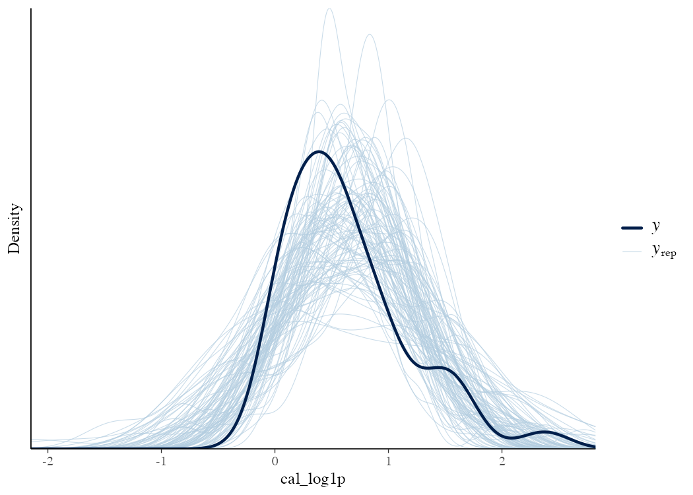

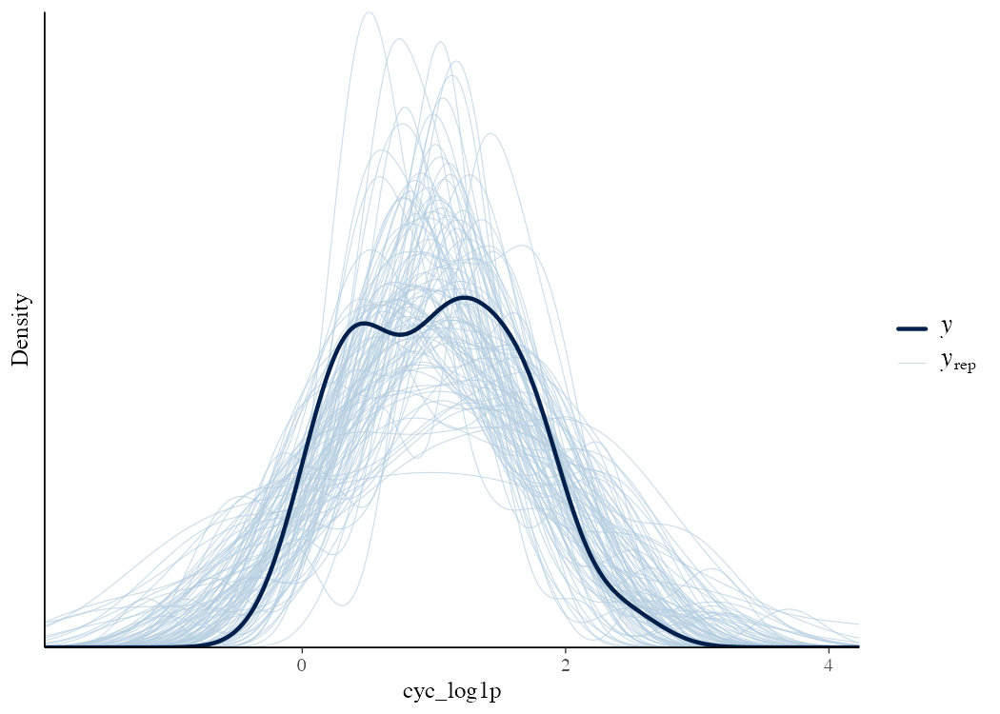

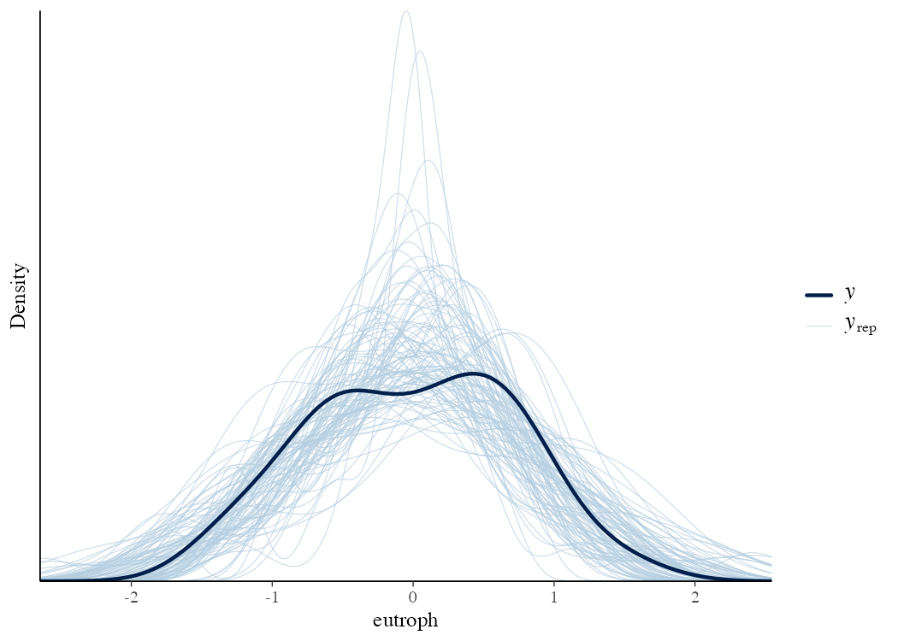

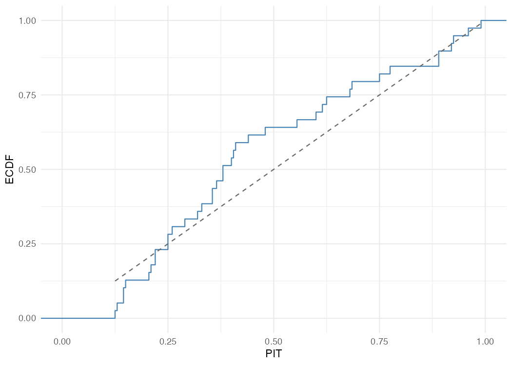

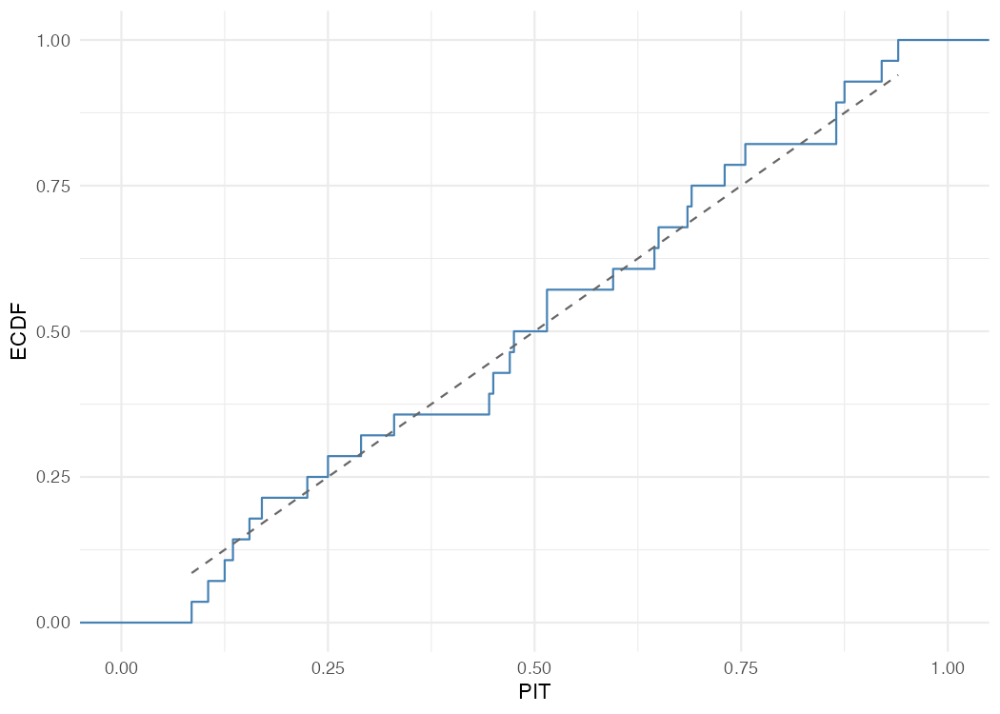

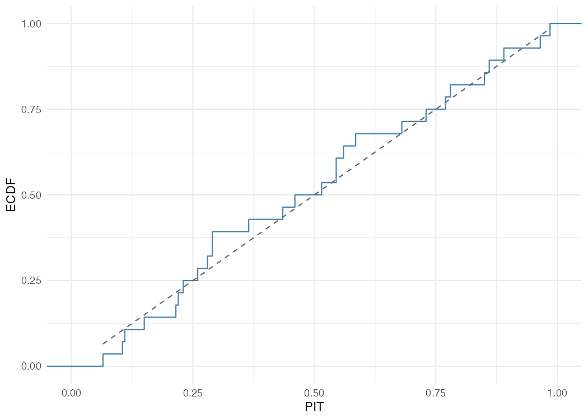

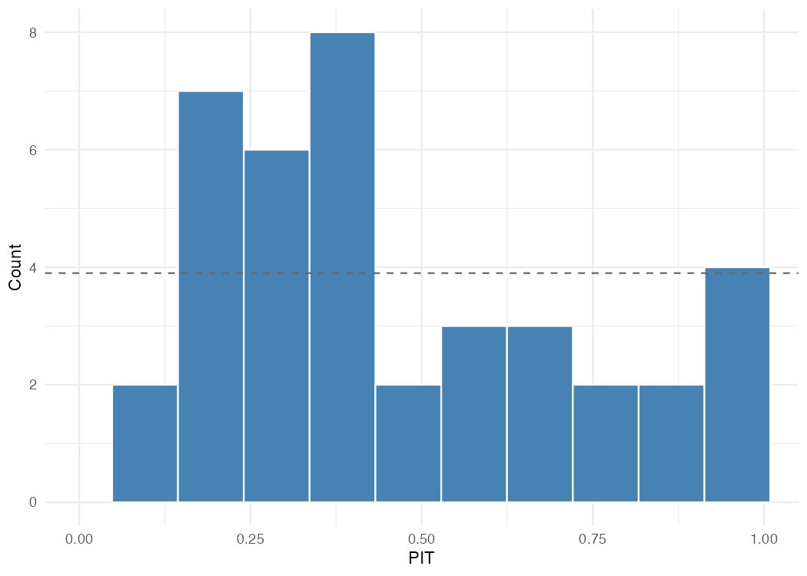

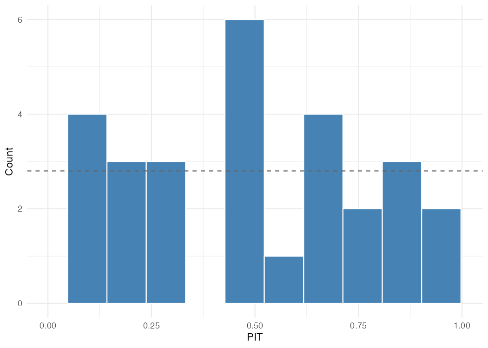

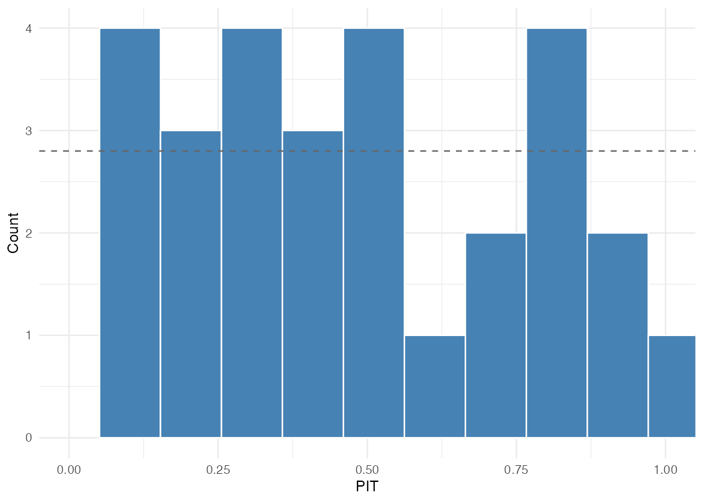

### Path diagram

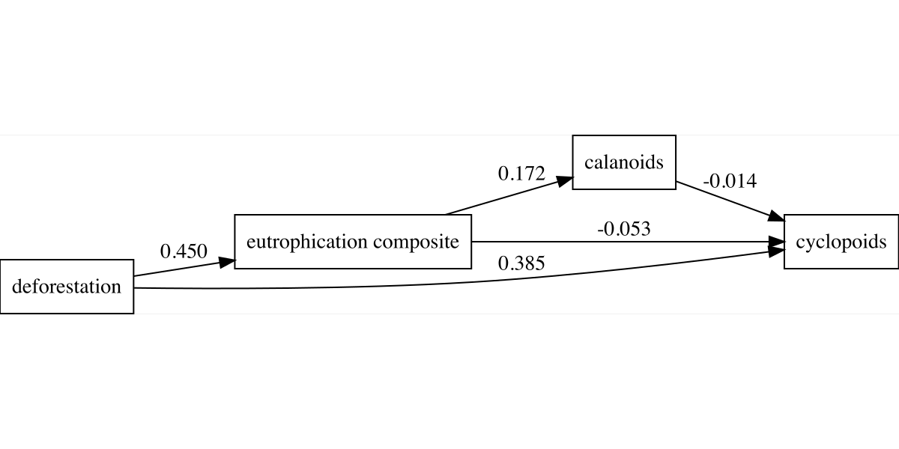

